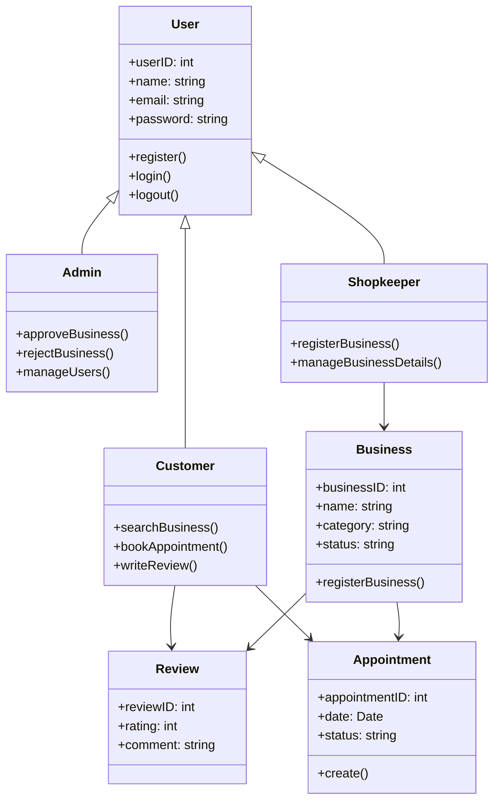

### IntelliBiz Class Diagram
This class diagram represents the main entities in the IntelliBiz platform and their relationships. It helps in understanding the system's architecture and interactions:

- **User** is the base class inherited by `Admin`, `Shopkeeper`, and `Customer`.
- **Admin** can approve or reject business registrations and manage users.
- **Shopkeeper** can register and manage business details.
- **Customer** can search for businesses, book appointments, and write reviews.
- **Business** stores business-related details and is associated with `Review` and `Appointment`.
- **Appointment** represents booking details with customers.
- **Review** contains customer feedback and ratings.

