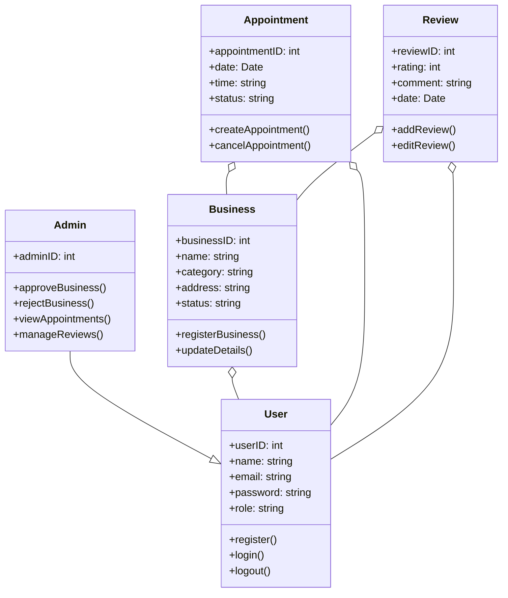

### IntelliBiz Domain Model Diagram

This domain model diagram provides a high-level overview of the IntelliBiz system, depicting key entities and their relationships:

- **User**: A general entity representing system users, including customers and shopkeepers.
- **Admin**: A specialized user with additional privileges to approve/reject businesses and manage appointments/reviews.
- **Business**: Represents businesses that users can register and manage.
- **Appointment**: Captures details of scheduled appointments between customers and businesses.
- **Review**: Stores customer feedback and ratings related to businesses.

